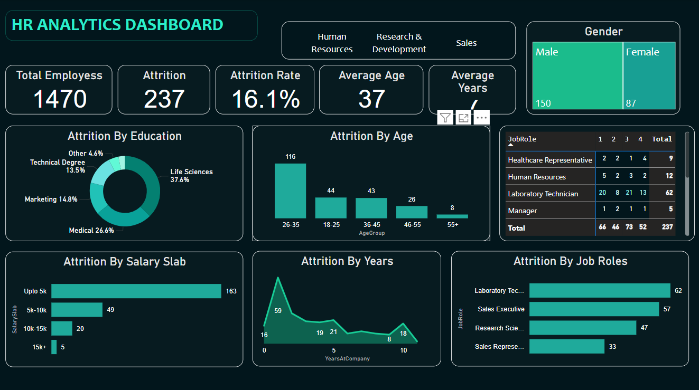

# HR-Analytics-Dashboard

### Project Overview
- The HR Analytics Dashboard is designed to provide insights into employee data, including attrition rates, hiring trends, and performance metrics. This interactive Power BI dashboard helps HR teams and decision-makers optimize workforce strategies through data-driven insights.

### Purpose & Objectives
The primary goal of this project is to analyze and monitor workforce dynamics by visualizing key HR metrics. The dashboard helps in:
- Understanding employee attrition trends and identifying retention strategies
- Tracking new hires, promotions, and department-wise workforce distribution
- Analyzing employee performance metrics
- Evaluating salary distribution and compensation trends
- Gaining insights into workforce diversity and engagement

###  Tools & Technologies Used
- Power BI (Data Visualization, Transformation, DAX, Power Query)
- Excel (Data Cleaning & Preprocessing)

 ### Key Features of the Dashboard
- Attrition Analysis: Breakdown of employees leaving the company and the reasons behind it.
- Hiring & Promotions Trends: Visualization of recruitment and internal promotions over time.
- Performance Metrics: Insights into high-performing employees and areas of improvement.
- Salary Distribution: Salary trends across departments and job roles.
- Diversity Insights: Gender, age group, and department-wise workforce distribution.

### Dashboard Preview

